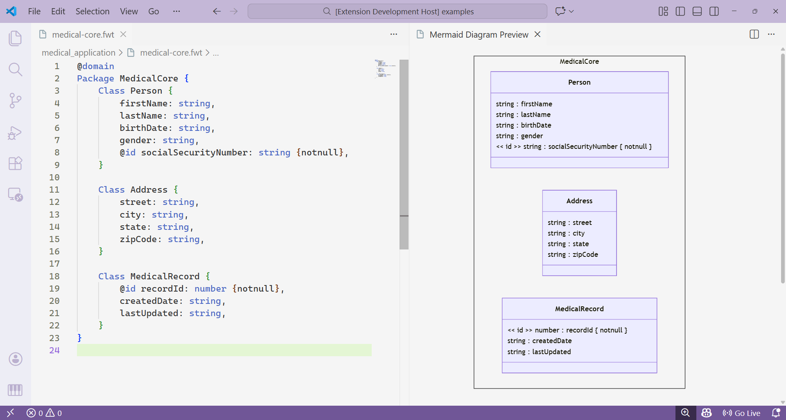
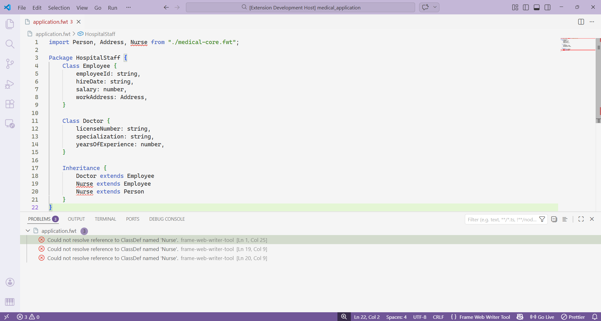

# FrameWeb Writer Tool

**Model web applications visually using the FrameWeb methodology**

FrameWeb Writer Tool (FWT) is a powerful VS Code extension that brings UML-based web application modeling to your editor. Built on the [FrameWeb methodology](https://nemo.inf.ufes.br/en/projetos/frameweb/), it provides a complete DSL (Domain-Specific Language) for designing web systems with real-time validation and automatic diagram generation.

<div alig="end">
	
</div>

## ✨ Key Features

- **📝 Smart Syntax**: Intuitive DSL designed specifically for web application modeling
- **⚡ Real-time Validation**: Syntax checking as you type, just like programming languages
- **🎨 Auto-generated Diagrams**: Save your file and instantly see your UML diagrams
- **🔧 Configurable Types**: Define custom types via `fwt.config.json` for your project
- **🎯 FrameWeb Compliant**: Full support for the FrameWeb methodology patterns



## 🚀 Getting Started

### Installation

1. Download the latest `.vsix` file from the [releases page](https://github.com/alekswheeler/frameweb-writer-tool/releases)
2. In VS Code, go to Extensions view (Ctrl+Shift+X)
3. Click the "..." menu → "Install from VSIX..."
4. Select the downloaded file

### Basic Usage

1. **Create a new file** with the `.fwt` extension

```
   myapp.fwt
```

2. **(Optional) Configure types** by creating a `fwt.config.json` file in your workspace:

```json
{
  "types": ["String", "Integer", "Boolean"]
}
```

3. **Start modeling** - Write your web application model using the FWT syntax

4. **Generate diagram** - Simply save your file (Ctrl+S) and the UML diagram will be automatically generated!

## 📖 Example

Here's a quick example of FWT syntax:

```fwt
@domain
Package example {
	@transient
	Class Statistics {
		submissions: number,
		totalReviews: number,
		pendingReviews: number,
	}

	Class Submission {
		@id doi: string,
		tile: string,
		keyword: string,
		abstract: string,
		pdfFile: binary,
		submissionDate: date,
	}

	Association {
		Submission [1] -> [0..1] Statistics
	}
}
```

## 📚 Documentation

For complete syntax reference and advanced features, visit our [Wiki](https://github.com/alekswheeler/frameweb-writer-tool/wiki) (Portuguese).

## 🎯 Use Cases

- Design MVC web applications
- Model domain entities and relationships
- Define navigation flows
- Document web system architecture
- Teach web engineering concepts

## 🤝 Contributing

We welcome contributions! Whether you want to report a bug, suggest a feature, or contribute code, check out our [Contributing Guide](how_contribute.md) to get started.

Ways to contribute:

- 💬 Start a discussion or report an issue
- 🐛 Fix bugs or add features
- 📖 Improve documentation
- 🌍 Help with translations

---

**Happy Modeling! 🎨**
